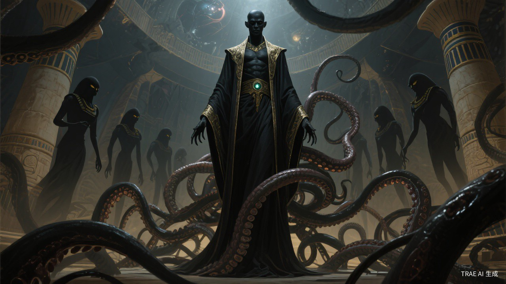
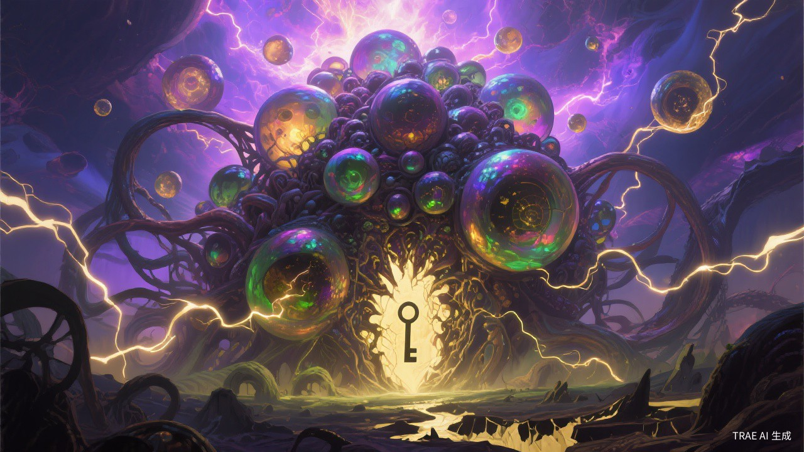
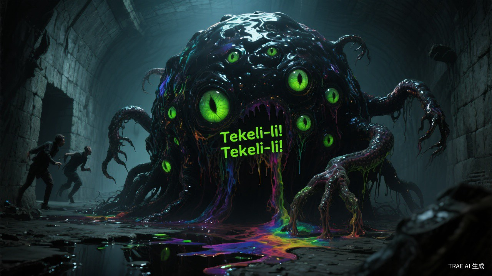

# CoC-kb

> 克苏鲁的呼唤（Call of Cthulhu）第七版 TRPG 知识库

基于 Karpathy 的 [LLM Wiki](knowledge-base/wiki/concepts/llm-wiki.md) 模式构建，从官方规则书中系统提取的 COC 第七版规则知识库，涵盖游戏机制、神话生物、法术魔法等完整内容。

## 神话生物图鉴

> 以下配图均由 **[TRAE](https://trae.ai/)** AI 生成，仅供知识库展示使用，不属于原书内容。

<p align="center">
  <table>
    <tr>
      <td align="center" width="50%">
        <br/>
        <b>克苏鲁 (Cthulhu)</b><br/>旧日支配者 · 沉睡于拉莱耶
      </td>
      <td align="center" width="50%">
        <br/>
        <b>阿撒托斯 (Azathoth)</b><br/>外神 · 盲目痴愚之神
      </td>
    </tr>
    <tr>
      <td align="center" width="50%">
        <br/>
        <b>奈亚拉托提普 (Nyarlathotep)</b><br/>外神 · 伏行之混沌
      </td>
      <td align="center" width="50%">
        <br/>
        <b>犹格·索托斯 (Yog-Sothoth)</b><br/>外神 · 万物归一者
      </td>
    </tr>
    <tr>
      <td align="center" width="50%">
        <br/>
        <b>哈斯塔 (Hastur)</b><br/>旧日支配者 · 黄衣之王
      </td>
      <td align="center" width="50%">
        <br/>
        <b>修格斯 (Shoggoth)</b><br/>神话怪物 · Tekeli-li!
      </td>
    </tr>
  </table>
</p>

## 来源

| 书籍 | 页数 | 类型 |
|------|------|------|
| 克苏鲁的呼唤 40周年纪念版 | 470页 | 核心规则书 |
| 克苏鲁的呼唤第七版调查员手册 | 162页 | 规则补充 |
| 怪物之锤 第一卷：神话怪物 | 210页 | 规则扩展 |
| 怪物之锤 第二卷：神话神祇 | 258页 | 规则扩展 |

## 内容概览

共计 **269 页面**，包含 56 个概念页面、209 个实体页面、4 个来源摘要。

### 概念页面 `wiki/concepts/`

游戏规则与机制的系统化整理：

- **游戏基础** — 游戏概述、洛夫克拉夫特与克苏鲁神话背景
- **调查员** — 创建流程、属性系统、衍生属性、职业系统、技能系统、经验成长
- **游戏机制** — 技能检定、奖励/惩罚骰、对抗检定
- **战斗** — 战斗系统、战斗轮、格斗、射击、伤害治疗、护甲、毒剂
- **理智** — 理智系统、理智检定、疯狂、恐惧症、躁狂症、恢复
- **魔法** — 魔法系统、神话典籍、法术列表、深层魔法、神话造物、神祇指南
- **守秘人** — 守秘人指南、NPC、灵感检定、察觉检定、模组创作、怪物创造
- **调查员手册** — 咆哮的二十年代、调查员组织、调查员生涯、旅行交通参考
- **装备** — 装备列表、武器列表
- **附录** — 术语表（70+条）、中英译名对照、洛氏描写词汇（400+词）、版本转换

### 实体页面 `wiki/entities/`

神话世界中的生物、人物与模组：

- **外神** — 阿撒托斯、奈亚拉托提普、犹格·索托斯、莎布·尼古拉丝 等 9 位
- **旧日支配者** — 克苏鲁、哈斯塔、达贡、伊格、茨夏格瓦 等 40+ 位
- **旧神** — 诺登斯、巴斯特 等
- **神话种族** — 深潜者、米·戈、远古种族、蛇人、伊斯人 等 19 个种族
- **神话怪物** — 修格斯、拜亚基、星之吸血鬼、廷达罗斯猎犬 等 70+ 种
- **传统怪物** — 幽灵、木乃伊、吸血鬼、狼人、僵尸 等
- **野兽** — 常见动物的数据
- **模组** — 暗黑森林、猩红书信、闹鬼 等

### 图片 `wiki/images/`

约 194 张实体配图，与实体页面一一对应。所有图片由 **TRAE** AI 生成，用于辅助理解实体形象，不属于原书内容。

## 调查员卡片应用

除知识库外，本项目还包含两款面向玩家的调查员卡片工具，均基于纯前端技术构建（HTML/CSS/JS，无框架依赖），可直接在浏览器中打开使用。

### 角色卡创建器

> `apps/coc_character_sheet/` — 8 步引导式调查员角色创建工具

一个完整的 CoC 7e 调查员角色创建向导，涵盖从基本信息到装备导出的全流程。

#### 8 步创建流程

| 步骤 | 内容 | 说明 |
|:----:|------|------|
| 1 | 基本信息 | 姓名、性别、年龄、居所、故乡、时代（1920s/现代）、头像选择 |
| 2 | 属性生成 | 3D 骰子掷出 8 项核心属性（STR/CON/SIZ/DEX/APP/INT/POW/EDU）+ 幸运值 |
| 3 | 年龄调整 | 根据年龄段自动计算 EDU 成长次数、属性减值、幸运值调整 |
| 4 | 职业选择 | 28 个预设职业 + 自定义职业，含洛夫克拉夫特经典职业标记 |
| 5 | 技能分配 | 职业技能点 + 兴趣技能点双轨分配，滑块交互 |
| 6 | 背景故事 | 10 大类别背景条目，随机灵感表自动生成叙事文本 |
| 7 | 装备决定 | 按信用评级浏览物品/武器数据库，支持搜索和自定义 |
| 8 | 完成导出 | 全字段可编辑角色卡 + `.coc7` 文件导出 |

#### 数据规模

| 数据类型 | 数量 | 说明 |
|---------|:----:|------|
| 技能 | **90** | 常规 46 + 格斗 8 + 射击 7 + 科学 12 + 艺术手艺 14 + 生存 3 |
| 职业 | **28** | 含 8 个洛夫克拉夫特风格经典职业，支持自定义 |
| 装备 | **~451** | 1920s ~288 件 + 现代 ~163 件，覆盖 17 个分类 |
| 武器 | **~171** | 1920s ~82 件 + 现代 ~89 件，含完整战斗属性 |
| 头像 | **20** | 10 男 + 10 女，职业主题 AI 生成头像 |
| 随机名称 | **~2000** | 48 名 × 42 姓组合 |
| 背景灵感表 | **6 大类** | 形象描述/思想信念/重要之人/意义之地/宝贵之物/特质 |

#### 技术亮点

- **自研 3D 骰子物理引擎** — CSS 3D Transform 实现，含碰撞检测、墙壁反弹、自然停止对齐
- **localStorage 持久化** — 创建过程自动保存，刷新不丢失进度
- **`.coc7` 文件导出** — 自定义压缩格式，可与角色卡追踪器互通
- **暗色克苏鲁主题** — 深蓝黑底色 + 金色强调，20+ CSS 变量统一管理

### 角色卡追踪器

> `apps/character-tracker/` — 模拟纸质角色卡的调查员数据追踪工具

一个模拟实体角色卡正反面的数据展示与追踪工具，采用模块化多文件架构，适合在游戏过程中实时管理调查员状态。

#### 正面 — 战斗与技能

- **调查员信息** — 姓名、玩家、职业、年龄、性别、居所、故乡、时代 + 头像
- **9 项属性** — 8 项核心属性 + MOV，每项含骰子检定按钮和检定单元格（常规/困难/极难）
- **资源追踪条** — HP（含重伤/濒死/昏迷状态）、幸运值、MP、SAN（含临时/不定/永久疯狂标记）
- **91 项技能** — 6 大分类 + 自定义技能，三栏布局，每项含检定值和骰子按钮
- **武器表格** — 9 列完整战斗属性（常规/困难/极难成功率、伤害、射程、次数、装弹、故障）
- **格斗面板** — 伤害加值（DB）、体格（Build）、躲闪（Dodge）

#### 背面 — 故事与参考

- **背景故事** — 10 个类别（个人描述、特质、思想信念、伤口疤痕、重要之人、恐惧症、意义之地、神话典籍、宝贵之物、第三类接触）
- **随身物品 & 资产** — 动态物品列表 + 信用评级/可支配现金
- **快速参考规则** — 技能检定表（大失败→大成功）+ 受伤治疗参考（8 项）
- **调查员同伴** — 圆形辐射布局，中心"我" + 8 个同伴节点

#### 3D 骰子检定系统

- **7 种骰子** — D4/D6/D8/D10/D12/D20/D100，每种最多 20 个
- **骰子表达式** — 支持 `1d100`、`2d6+4` 等符号输入
- **10 种视觉主题** — 含 CoC 专属主题，WebAssembly 物理引擎驱动
- **全局触发** — 角色卡上所有骰子按钮均可一键打开骰子面板

#### 技术亮点

- **模块化多文件架构** — 按功能拆分为 render/（渲染层）、data/（数据层）、dice-module.js（骰子模块）等
- **`.coc7` 文件导入** — 与角色卡创建器无缝互通，导入后自动保存
- **localStorage 持久化** — 角色数据自动保存，刷新不丢失
- **A4 纸规格布局** — 210mm × 297mm，支持打印输出
- **响应式设计** — 适配桌面和移动端
- **E2E 测试** — Playwright 测试覆盖 12 个测试组约 30+ 用例，另附 Python 备选测试脚本

### 两个应用的协同

```
角色卡创建器                    角色卡追踪器
┌──────────────┐    .coc7     ┌──────────────┐
│  8步引导创建  │ ──────────→ │  导入角色数据  │
│  掷骰/选职业  │              │  战斗中追踪    │
│  分配技能点   │              │  骰子检定      │
│  导出 .coc7  │              │  状态管理      │
└──────────────┘              └──────────────┘
```

在创建器中完成角色创建后，导出 `.coc7` 文件，再在追踪器中导入即可开始游戏。两个应用共享一致的暗色金色视觉主题和游戏数据体系。

## 目录结构

```
CoC-kb/
├── .gitignore
├── .obsidian/                   # Obsidian 配置
├── knowledge-base/
│   ├── CLAUDE.md                # 知识库维护规范（LLM Schema）
│   ├── wiki/
│   │   ├── index.md             # 内容索引
│   │   ├── log.md               # 操作日志
│   │   ├── concepts/            # 概念页面（56个）
│   │   ├── entities/            # 实体页面（209个）
│   │   ├── images/              # 实体配图（~194张，TRAE AI 生成）
│   │   └── sources/             # 来源摘要（4个）
│   └── raw/                     # 原始PDF（未纳入版本控制）
├── apps/
│   ├── coc_character_sheet/     # 调查员角色卡创建器（多文件 SPA）
│   │   ├── index.html
│   │   ├── css/                 # 样式（base.css + components.css）
│   │   ├── js/
│   │   │   ├── data/            # 游戏数据（技能/职业/装备/武器/随机表）
│   │   │   ├── render/          # 渲染层（路由 + 步骤渲染 + 进度条）
│   │   │   ├── state.js         # 全局状态 + localStorage
│   │   │   ├── dice-physics.js  # 自研 3D 骰子物理引擎
│   │   │   ├── utils.js         # 工具函数
│   │   │   ├── navigation.js    # 导航逻辑 + 导出
│   │   │   └── init.js          # 启动入口
│   │   └── assets/avatars/      # 20 张职业主题头像
│   └── character-tracker/       # 调查员角色卡追踪器（多文件架构）
│       ├── index.html           # HTML 入口
│       ├── css/                 # 样式（tracker.css）
│       ├── js/
│       │   ├── data/            # 数据（技能基础值 + 默认角色）
│       │   ├── render/          # 渲染层（信息/属性/追踪条/技能/武器等）
│       │   ├── app.js           # 主入口
│       │   ├── dice-module.js   # 3D 骰子模块（ES Module）
│       │   ├── import.js        # .coc7 导入/清除
│       │   └── utils.js         # 工具函数
│       ├── assets/              # 背景图 + 角饰 SVG
│       ├── dice-box/            # 3D 骰子引擎库 + 10 种主题
│       ├── e2e/                 # E2E 测试（Playwright + Python）
│       ├── playwright.config.js # Playwright 配置
│       └── package.json         # 最小化配置（仅用于测试脚本声明）
└── README.md
```

## 使用方式

### Obsidian

本知识库使用 [Obsidian](https://obsidian.md/) 构建，推荐用 Obsidian 打开以获得最佳体验（双向链接、图谱视图等）。

```bash
git clone https://github.com/digitalghost/CoC-kb.git
# 用 Obsidian 打开克隆的文件夹即可
```

### 调查员卡片应用

两款应用均为纯静态前端项目，无需安装依赖或构建步骤：

```bash
git clone https://github.com/digitalghost/CoC-kb.git
# 直接在浏览器中打开对应 HTML 文件即可使用
open apps/coc_character_sheet/index.html      # 角色卡创建器
open apps/character-tracker/index.html        # 角色卡追踪器
```

或通过任意静态文件服务器提供服务。

### 直接浏览

所有内容均为 Markdown 格式，可以直接在 GitHub 上阅读，或用任意文本编辑器/Markdown 阅读器打开。

## 维护说明

知识库的维护规范定义在 `knowledge-base/CLAUDE.md` 中，遵循以下原则：

- 所有规则数据忠实于原始规则书，不编造规则
- 使用 `[[页面路径]]` 格式维护页面间的交叉引用
- 原始来源（`raw/`）不可修改，仅通过 wiki 层进行知识整理
- 操作日志（`log.md`）仅追加，不删除历史记录

## 许可

本知识库内容整理自 Chaosium 出版的《克苏鲁的呼唤》系列规则书。规则书原文版权归 Chaosium Inc. 所有。知识库中的实体配图由 TRAE AI 生成，仅供学习参考。
